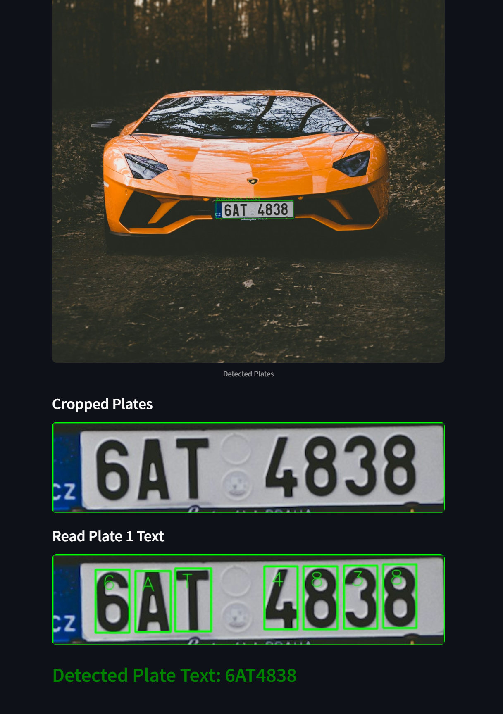
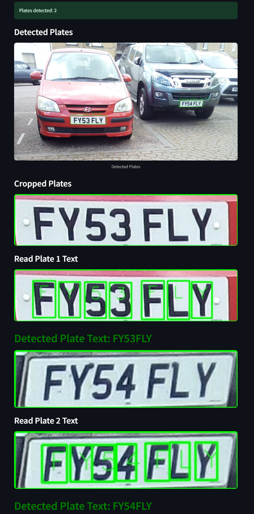

# Car Plate Recognition App 🚗


A simple and efficient **car plate recognition system** built using **YOLOv8** for plate detection and a custom object detection model for character recognition. This project allows you to **upload images, detect vehicle plates, and extract text** from them using advanced AI models.  

### **Training Details**  
Two separate **YOLOv8 models** were trained using two different image datasets:  
- One model detects **vehicle plates**.  
- The other model detects **characters** on the plates.  

The training process for these models is shown in the following notebooks:  
- **[Plate Detection Notebook](plate_detection.ipynb)** – Detects license plates in images.  
- **[Plate Reading Notebook](plate_reading.ipynb)** – Recognizes characters from detected plates.  

For more details on **YOLO training**, you can visit my **[Kaggle profile](https://www.kaggle.com/iskorpittt/code)**.  


## Features

- Detects car plates in images using YOLOv8.
- Crops and displays detected plates.
- Recognizes plate text using a custom character recognition model.
- Streamlit-based user interface for easy interaction.


## Screenshots  

<table>
  <tr>
    <td></td>
    <td></td>
  </tr>
</table>


## Installation

### Prerequisites

Make sure you have Python 3.x installed. You also need `pip` to install the dependencies.


```bash
git clone https://github.com/your-username/car-plate-recognition.git
cd car-plate-recognition
python -m venv venv

On Windows:
venv\Scripts\activate

On macOS/Linux:
source venv/bin/activate

pip install -r requirements.txt

```

Place these models in the ./models/ directory.

## Usage

1. Run the app:

```bash
streamlit run app.py
```

2. Go to the URL displayed in the terminal to interact with the application.
   
3. Upload an image containing a vehicle, and the system will detect the plates and attempt to read the text from them.
